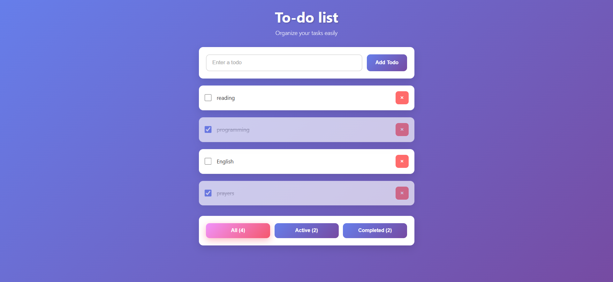

# Modern To-Do List

A simple and elegant To-Do List application built with **React** and **Vanilla CSS**, focusing on a clean UI and smooth user experience.

## 📸 Preview

## Features
* **Modern UI:** Clean design with a beautiful purple gradient background.
* **Smart Filtering:** Bottom buttons to filter between All, Active, and Completed tasks with real-time counters.
* **Auto-Save:** Saves tasks in browser `localStorage` so data is never lost on refresh.
* **Visual Feedback:** Striking line-through effect instantly applied to completed tasks.

## 🛠️ Tech Stack
* React (Vite)
* Vanilla CSS
* LocalStorage

## 🚀 Live Demo & Preview

🔗 https://modern-to-do-list-chi.vercel.app
